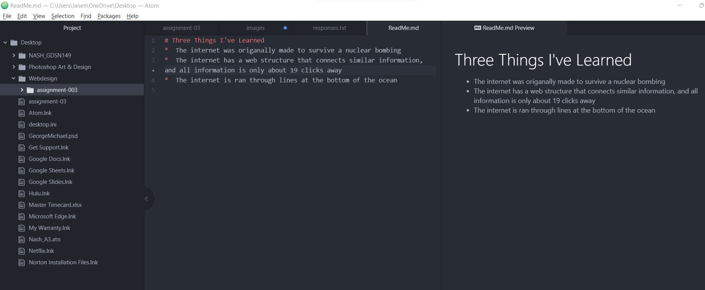

# Three Things I've Learned
*  The internet was origanally made to survive a nuclear bombing
*  The internet has a web structure that connects similar information, and all information is only about 19 clicks away
*  The internet is ran through lines at the bottom of the ocean

[Line of Action](https://line-of-action.com/practice-tools/figure-drawing)

[My Responses](./responses.txt)

