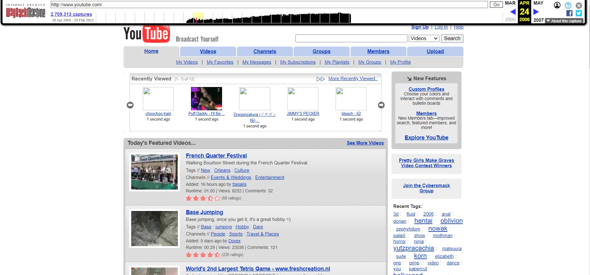
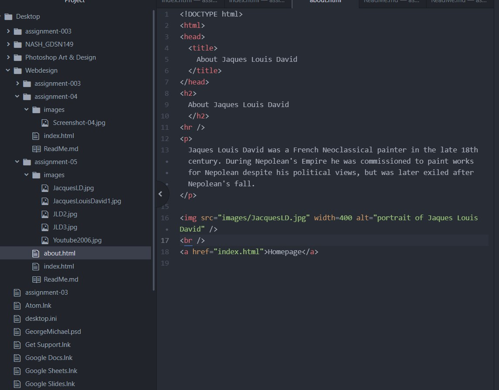

I decided to visit YouTube in it's early days: 2006. It is a completely different format, from ratings, video layout, and feel. It isn't as popular, and the videos are short and straight forward, in a stacked order of one video per line. In 2022, YouTube has a few videos across in larger format, and will automatically pull more videos up as you scroll.

