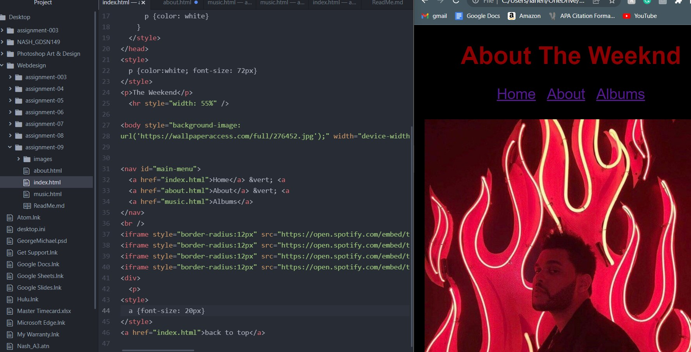

I have really enjoyed working in HTML. It was brand new for me at the beginning of the semester, but it is something that I have come to love. I enjoy the problem-solving and the construction of the websites. It has been challenging at times, but rewarding when it all comes together.
I'm very excited to get into CSS, as I like to focus on the look/feel of the website...it's something I spend the most time on. I'm excited to learn more tools to make my work more inline of what I envision.

