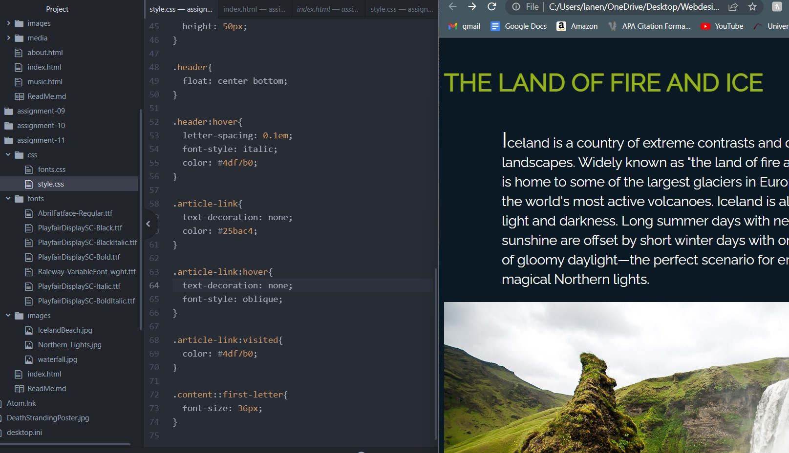

Typography is more about the styling of text; arrangement, legibility, readability, and appeal. This includes color, size, spacing, and font.
Fallback fonts are important because depending on different computers/systems there can be different fonts, or a font that isn't supported on one. So having a fallback allows you to have the two different yet similar fonts to achieve the look you want for the website.
A system font is a font that is installed on your local drive, but may not be web compatible. Web fonts are hosted on a server and are not available on devices, but they require certain elements to be called correctly. Web-safe fonts are ones that are available on both Windows and Mac systems, allowing the developer to know both systems support that same font.
